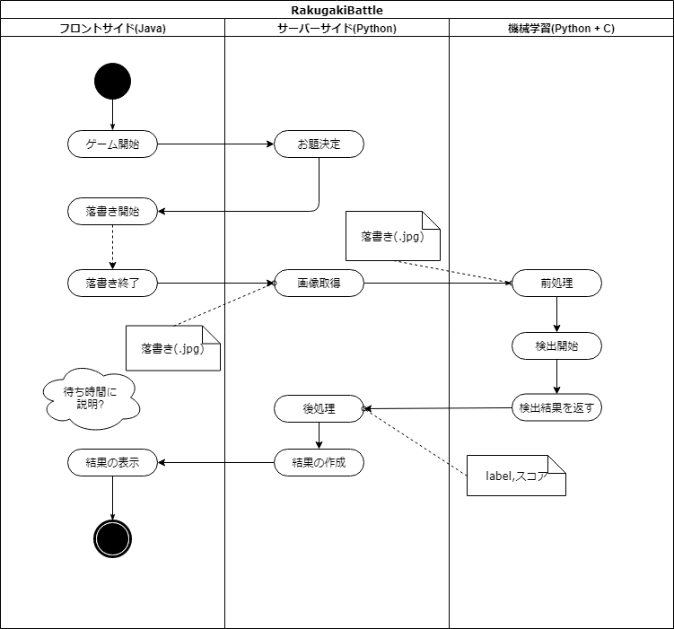

# RakugakiBattle 仕様
2019/06/06 新規作成

## シーケンス図

### フロントサイド
android にて実装  
そのためJava を使う

### サーバーサイド
機械学習が使いやすいPython3 を使う

### 機械学習
検出器にはYOLOv3 を使う  
実行にはPython3 を使う

## フロントサイド

### ゲーム開始
ニックネームを取得しサーバーに投げる  
ニックネームは半角英数のみとする  
ここでサーバーに接続する

### 落書き開始
サーバーからお題と, ユーサーIDを受け取る  
サーバーからゲーム開始合図を受け取ったら以下を開始  
サーバから受け取ったお題を表示し, 落書きを開始する  
できればタイマーを表示する

### 落書き終了
制限時間になったら音がなるといいかも  
制限時間になったら落書きを .jpg 形式で保存する  
ファイル名は[{ユーサーID}-{ニックネーム}.jpg]  
保存した落書きをサーバーに投げる

### 結果を返すまでの待ち時間
(もしCPUでYOLOv3を動かす場合)  
説明動画でも流す?  
いらない気がするけど...

### 結果の表示
結果を表示する  
音があるとインパクトあるかも  
その後サーバとの接続を切断し, ゲーム開始街状態に入る  

## サーバーサイド

### オブジェクト
#### class User
self.IPAddress (String) # IPアドレス  
self.PortNumber (int) # ポート番号  
self.ID (int) # ユーザーID インスタンス作成時に生成  
self.name (String) # ユーザー名  
self.img-path (String) # 落書きのファイルパスを格納  
self.result (dict) # 機械学習にて検出したものとその類似度のペアを格納  
self.score (int) # 算出したスコアを表示する  
ランダムでユーザーIDを振る  

#### class Room
self.roomID (int) # 部屋ID インスタンス作成時に生成  
self.user (list) # 部屋に入っているユーザーを格納する配列  
	         # User インスタンスを格納する  
self.theme (String) # お題 部屋を締め切り, ゲームを開始する前に決める  
外部ファイル(多分 class.txt) からお題を取得  
その中からランダムで選定する  

### お題決定
クライアントから接続要求を受けたあと  
1. Userオブジェクトを生成  
2. User を部屋に入れる  
3. クライアントに対し, [ユーザーID,お題]を返す  

[部屋の入り方]  
待ち状態の部屋がない -> 部屋を作成  
待ち状態の部屋がある -> その部屋に入る  

### 画像取得
画像をフォルダに保存し, そのパスを User インスタンスに格納する  

### 後処理
機械学習側から返された {"label":socre} を受け取り User インスタンスに格納  
受け取ったリストの中からお題と一致する項目を探す  
お題と一致する項目がある -> その類似度がスコア  
お題と一致する項目がない -> 0点?  
算出したスコアを User インスタンスに格納する  

### 結果の生成
部屋に属するユーザーが全員スコアの算出が終わったらクライアントに結果を返す  

## 機械学習

### 前処理
もし必要であればここである程度画像を加工する  
(YOLOv3 であれば処理は必要なし)  
加工後, YOLOv3 にファイルパスを渡す  
(Python の関数を呼び出し, その引数にファイルパスを入れる)  

### 検出開始
受け取ったパスをもとにYOLOv3 を用いて検出を開始する  
重みファイル等はプログラム内でベタ書き?  
(このとき Python3 を用いてYOLOv3 を動かす)  

### 検出結果を返す
検出結果を Python3 の dict(辞書) 形式で返す  
{"label":score}

### 参考文献
[Quiita](https://qiita.com/massie_g/items/a2bcfac4fed66b1b0717)

### memo
検出開始も検出結果を返すも一つの関数で行う  
引数:画像のパス
戻り値:{"label":score}
/python/darknet.py を参考に作る 

